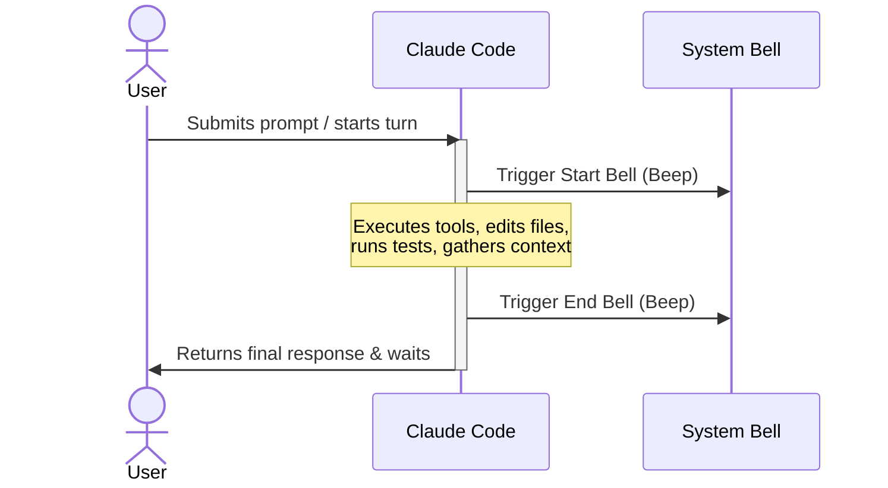

# 🔔 bell-ringer

A lightweight, zero-dependency skill for [Claude Code](https://claude.com/claude-code) that triggers the system bell **at the start and end of every turn**. Never stare at your terminal waiting for a long task to finish again—just listen.

---

<p align="center">
  <a href="https://github.com/martian7777/bell-ringer-skill/blob/main/LICENSE">
    
  </a>
  <a href="https://claude.com/claude-code">
    
  </a>
  <a href="#">
    
  </a>
  <a href="https://github.com/martian7777/bell-ringer-skill/pulls">
    
  </a>
</p>

---

## 🎯 The Flow-State Solution

When delegating complex multi-step tasks to Claude Code, you shouldn't have to keep switching tabs or staring at a static cursor to check if it's done. 

`bell-ringer` adds non-intrusive auditory feedback:
1. **The Startup Beep:** One quick chime when Claude receives your prompt and begins executing tools.
2. **The Handshake Beep:** One final chime when Claude finishes all tasks and is waiting for your next input.

---

## 🔄 Turn Lifecycle

The diagram below shows how the skill integrates seamlessly with Claude's execution loop:



---

## 🚀 Installation

Install the skill by cloning this repository directly into your local Claude Code skills directory.

### 1. Clone the Repository

Choose the command block corresponding to your operating system:

#### 💻 macOS / Linux (Bash)
```bash
git clone https://github.com/martian7777/bell-ringer-skill.git ~/.claude/skills/bell-ringer
```

#### 🪟 Windows (PowerShell)
```powershell
git clone https://github.com/martian7777/bell-ringer-skill.git $env:USERPROFILE\.claude\skills\bell-ringer
```

### 2. Verify Installation
1. Restart your current Claude Code terminal session.
2. Ask Claude to check if the skill is loaded:
   > *"What skills do you have available?"*
3. You should see `bell-ringer` listed as an active skill.

---

## 🔔 Permission-prompt bells (one-time hook setup)

The skill alone covers the **start** and **end** of each turn. It cannot ring the bell when Claude Code pauses to ask you something like *"Do you want to continue?"* or *"Allow PowerShell tool?"* — during those prompts Claude's turn is paused, so no skill instruction can run. Those bells must be fired by the harness itself via a **Notification hook** in `settings.json`.

Merge the snippet below into `~/.claude/settings.json` (Windows: `%USERPROFILE%\.claude\settings.json`), then restart Claude Code.

#### 🪟 Windows
```json
{
  "hooks": {
    "Notification": [
      {
        "matcher": "",
        "hooks": [
          {
            "type": "command",
            "command": "powershell -NoProfile -Command \"[console]::beep(800,200)\""
          }
        ]
      }
    ]
  }
}
```

#### 💻 macOS / Linux
```json
{
  "hooks": {
    "Notification": [
      {
        "matcher": "",
        "hooks": [
          {
            "type": "command",
            "command": "printf '\\a'"
          }
        ]
      }
    ]
  }
}
```

If your `settings.json` already has other top-level keys, merge the `"hooks"` block into the existing object rather than replacing the file.

---

## 🛠️ Configuration & Customization

If you prefer custom sound effects, melodies, or voice notifications instead of the default terminal beep, you can easily customize the actions. Open `SKILL.md` in your favorite editor and modify the bell commands.

### Replacing with Built-in OS Audio Files

Instead of using the standard PC speaker beep, you can instruct Claude to trigger native system sound files:

| Operating System | Command Variant | Description |
| :--- | :--- | :--- |
| **macOS** | `afplay /System/Library/Sounds/Glass.aiff` | Plays a clean glass ping sound |
| **macOS (Alternative)**| `say "Ready"` | Uses text-to-speech to announce status |
| **Linux (PulseAudio)** | `paplay /usr/share/sounds/freedesktop/stereo/complete.oga` | Plays a default desktop success sound |
| **Linux (ALSA)** | `aplay /usr/share/sounds/alsa/Front_Center.wav` | Plays a standard wav sound |
| **Windows (PowerShell)** | `powershell -c "(New-Object Media.SoundPlayer 'C:\Windows\Media\notify.wav').PlaySync()"` | Plays a standard Windows notification sound |

### Adjusting Frequency and Duration (Windows Native)
If using the default PowerShell command on Windows `[console]::beep(Frequency, Duration)`, you can customize the pitch:
- High pitch: `[console]::beep(1200, 150)`
- Low/muffled pitch: `[console]::beep(400, 300)`

---

## 🔍 Troubleshooting

Because `bell-ringer` uses standard terminal control characters and system commands, any silence is usually related to terminal configurations or OS settings. Use the table below to resolve common issues:

| Environment | Issue / Symptom | Solution |
| :--- | :--- | :--- |
| **All Platforms** | Skill not listed in Claude | Confirm path is exactly `~/.claude/skills/bell-ringer/SKILL.md`. Ensure there are no nested subfolders. |
| **Windows Terminal** | Silent `[console]::beep` | Open Windows Settings → System → Sound. Verify output device is correct. Go to **Control Panel → Sound → Sounds tab** and make sure "Default Beep" has a sound assigned. |
| **VS Code Terminal** | No sound | Open VS Code Settings (`Ctrl+,`), search for `terminal.integrated.enableBell`, and ensure it is checked (`true`). |
| **iTerm2 (macOS)** | Silent bell | Open iTerm2 Preferences → Profiles → Terminal. Under **Terminal Bell**, ensure **Silence bell** is **unchecked**. |
| **GNOME Terminal** | Silent bell | Right-click the terminal window → Preferences → Profiles → Text. Ensure **Terminal bell** checkbox is enabled. |
| **macOS / Linux** | Silent `printf '\a'` | Try testing manually: run `printf '\a'` in your shell. If still silent, check your OS sound effects volume or try replacing the command with the `afplay` / `paplay` alternative. |

---

## 🧠 Under the Hood

Claude Code skills rely on system prompts combined with YAML frontmatter. Here is the configuration powering `bell-ringer`:

* **YAML Metadata**: Instructs Claude to activate the skill unconditionally on every user message.
* **Pre-turn Action**: Runs a shell command to emit the start signal before invoking any code edits, compiles, or test runners.
* **Post-turn Action**: Executes the final beep command immediately before returning the textual output to the terminal, signaling that control is handed back to you.

---

## 📄 License

This project is licensed under the [MIT License](LICENSE) — feel free to modify, fork, and use it however you see fit. Contributions are welcome!

